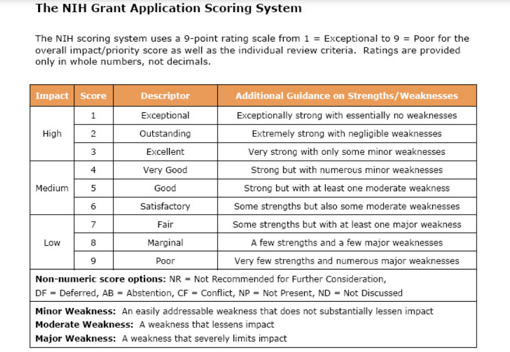

## Initial Perspectives on Research

Distributed REsearch Apprenticeships for Master’s (DREAM) Fellowship aims to provide non-CS students exposure to research within the domain of Computer Science.

### What are my past research experiences?

In the last decade, I have worked on several research grants focused primarily on human-subjects research. During my first semester as an undergraduate, I began working at the Tobacco Research and Intervention Program (TRIP) at the Moffitt Cancer Center on an R01 grant examining the development and efficacy of a smoking relapse prevention intervention for cancer patients. Over the next several years, I worked on various grants housed at TRIP in different capacities, including several leadership positions.

During this time, I also gained some experience working in a wet lab. Here, I helped design and independently conducted a study assessing the effects of a custom peptide on hearing thresholds and temporal processing in a mouse model of aging. After administering the peptide solution intranasally, I used electroencephalographic tests to measure the auditory brainstem response (ABR) of anesthetized subjects. In 2015, I presented a poster of my findings at the University of South Florida’s Undergraduate Research and Arts Colloquium.

Post-graduation, I worked on the VIRUSCAN Study, a prospective cohort study examining the risk of keratinocyte carcinoma associated with cutaneous viral infections. I presented a subset of the study findings at the Moffitt Scientific Symposium and co-authored several publications resulting from this study. My experiences working with electronic health records on this grant served as the initial catalyst for my pivot into Computer Science. This work sparked my interest in Clinical Informatics.

### What do I hope to get out of this experience?

While I am familiar with research, particularly human-subjects research, I am unfamiliar with research in the field of Computer Science. My aims for this experience are:

1. To be able to articulate the scientific process within this domain
2. To expand my technical skill set and gain experience working with domain-specific tools.
3. To gain an understanding of what a doctorate program in Computer Science might be like and finalize my future education plans.
4. To learn about Scientometrics!

### What am I excited for?

I am incredibly excited to expand my technical skill-set. Through iCAN, UIUC’s bridge to a Master’s in Computer Science program, I have learned Python and Java. I also have some minimal experience in Ruby from my undergraduate experiences. But, it still feels like there is a long road ahead of me before I’m comfortable calling myself a “computer scientist” with any confidence.

As such, any expansion to my technical skill set is welcome. This week, I found myself excited over successfully writing a shell script that allows me to connect to UIUC’s VPN and ssh into the lab’s remote server with just four keystrokes.

I’m looking forward to seeing what else I learn over the course of this summer!

### Do I have any concerns or worries?

My greatest concern is regarding the speed and intensity of this experience. I take my time reading scientific publications and absorbing the material, but it looks like I will have to start becoming more efficient if I want to keep up. I have yet to begin the work and I am already staring down a backlog of journal articles. 

### Next Steps

The first several weeks of this experience will be dedicated to learning the basics of Scientometrics research (i.e. the data, the tools, and the methods). Towards this end, I will be working on some assignments structured to expose me to the science behind Scientometrics.

## Learning Objectives

- Shell Scripts
- Linux Utilities
- PostGreSQL

## Meetings and Journal Club

I will be meeting with my research advisor, George, every Monday to discuss progress on assignments and learn more about scientometrics, aspects of what it means to be a scientist, and multitudinous other topics.

Additionally, every Thursday, our lab will be meeting to discuss a journal article chosen by one participant. The aim is to foster the habit of regularly reading scientific publications and foster our ability to think critically about scientific information and communicate our thoughts effectively. To this end, the presenter and participants will seek to answer the following questions about the publication under discussion:

1. What is the research question the author(s) are asking?
2. What methodology are they using to find the answer?
3. What results did they get?
4. Do their results answer their question?

At the end of the discussion, we will be using the National Institute of Health’s Grant Application Scoring Scale: 

## Blog Posts

One of my hopes for this blog is to document my experiences and learning journey within this lab. Consequently, the posts will center around what I have been working on and what I have learned. If there are any artefacts I produce, like reports or code, I'll include it here. 