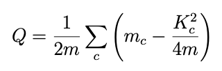
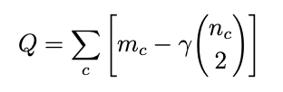

## Quality Functions

Previously, I mentioned some challenges in evaluating the quality of partitions of large networks. One method is to set some quality threshold and verify that partitions meet this threshold at minimum. Quality functions assign a score to each partition based on some threshold, and the partition with high scores are ranked higher.

The most popular quality function is modularity, which was described by Newman and Girvan (2004). The underlying idea is that large deviations in edge density from what is expected in a random graph reveal substructure. However, there are other quality functions that can also be used. For instance, the “conductance” of a partition measures the ratio of the number of edges that cross between communities to the total number of edges within a community, providing an alternative measure of community structure. Additionally, graph-based quality functions like normalized cut, ratio association, and internal density offer different perspectives on partition quality.

Leiden optimizes for modularity in clusters using two different quality functions: Modularity and the Constant Pott's Model (CPM). Both can be expressed as summation over communities. Here's the formula for the `Modularity Partition Type` 1:

By summing the difference between actual edges and expected edges over all communities, we are able to assign a partition a quality score. A higher quality score implies better community structure.

Here's the formula for the `Constant Pott's Model (CPM) Partition Type` 2: 

CPM is a slight variation of the previous quality function. Instead of examining the difference between actual and expected edges, here the difference between actual edges and all possible edges is found. It also uses a linear resolution parameter that provides control over the granularity of the cluster size. A larger resolution parameter provides a greater number of dense clusters, and a smaller resolution parameter will result in fewer, less dense clusters.

It's important to note that optimizing for modularity does not return an optimal solution. Also, a noted problem with modularity optimization may fail to identify small communities with larger ones. This problem is referred to as the “resolution limit.” 

While modularity is a widely used quality function, other measures exist as well. For example, the “conductance” of a partition measures the ratio of the number of edges that cross between communities to the total number of edges within a community. Lower conductance values indicate better community structure. Often, a single quality function might not capture all aspects of community structure. Different quality functions can be combined to refine results. 

1, 2 V.A. Traag, L. Waltman & N.J. van Eck (2019)

## Reflections

Last week, I submitted my second assignment on the Stack Overflow Network! [This](../files/A2Report.pdf) is an improved version of the report that I submitted. 

Setting up and using the Leiden package was a simple process, however, I'm struggling with figuring out how to analyze all the code. For the previous assignment, I *sftp*'d the network to my local server and was able to analyze it using Google Colab/Jupyter Notebook. This network is much larger, and it takes too long to graph/process. If I try to analyze the data remotely, I can't render the figure, so it must be transferred to my local server in order to verify it is correct. If it isn't correct, I have to return to the remote server and repeat this inefficient process. Clearly, this is an untenable system. I'm trying to see how I can use my local server's GUI while working remotely. Since I will be working with an even larger network for Assignment 3, it is imperative I figure out a better method for analysis. 

## Learning Objectives

- Cloning and using the CM++ Pipeline
- Cluster Connectivity

